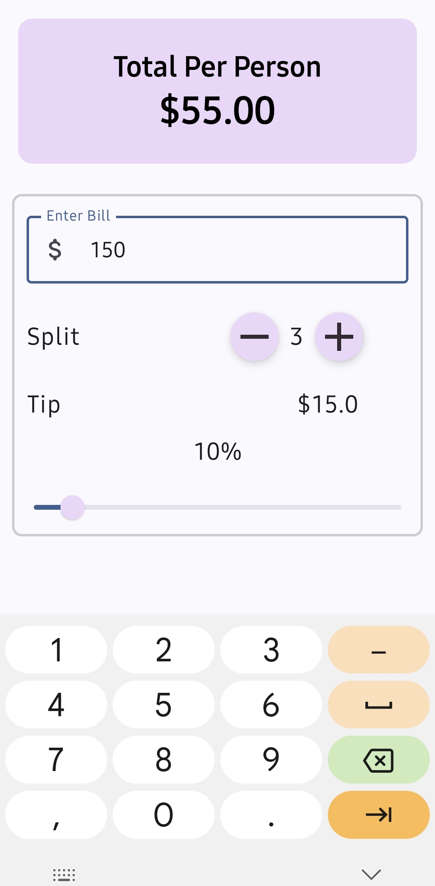

# Tip Calculator App

- A simple Tip Calculator android application, built entirely with Kotlin and Jetpack Compose.
- This Tip Calculator App allows users to easily calculate tips and split bills among multiple people.
- It features a clean and intuitive User Interface built with Jetpack Compose, providing a modern Android UI experience.



## Features

- Enter bill amount
- Adjust tip percentage
- Split bill among multiple people
- Real-time calculation of total per person

## Tech Stack

[](https://skillicons.dev)

- Kotlin
- Jetpack Compose
- Android Studio (IDE)

## Installation

1. Clone this repository:
   ```bash
   git clone https://github.com/SyedRizvi786092/split-it.git
   ```

2. Open the project in Android Studio.

3. Build and run the app on an emulator or physical device.

## Usage

1. Enter the bill amount.
2. Adjust the tip percentage if needed.
3. Use the +/- buttons to change the number of people splitting the bill.
4. The app will automatically calculate and display the total per person.

## Contributing

Contributions are welcome! If you'd like to contribute to this project, please follow these steps:

1. Fork the repository.
2. Create a new branch.
3. Make your changes.
4. Submit a pull request.
